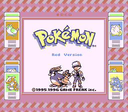
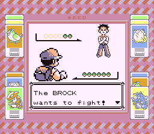
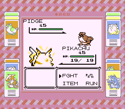
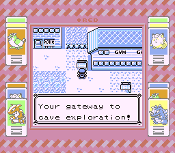
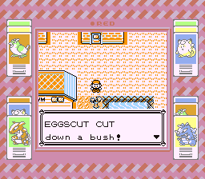
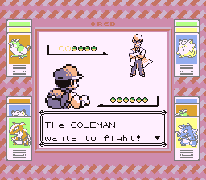

# Pokémon Red and Blue '96

This hack aims to replicate early translations of Pokémon Red and Blue based on footage and information.

It builds the following ROMs:

- Pokemon Red (UE) [S][!].gb `sha1: ea9bcae617fdf159b045185467ae58b2e4a48b9a`
- Pokemon Blue (UE) [S][!].gb `sha1: d7037c83e1ae5b39bde3c30787637ba1d4c48ce2`
- BLUEMONS.GB (debug build) `sha1: 5b1456177671b79b263c614ea0e7cc9ac542e9c4`
- dmgapae0.e69.patch `sha1: 0fb5f743696adfe1dbb2e062111f08f9bc5a293a`
- dmgapee0.e68.patch `sha1: ed4be94dc29c64271942c87f2157bca9ca1019c7`

To set up the repository, see [**INSTALL.md**](INSTALL.md). Keep in mind that this is an already old version of Pokered.

This is intended for use on PC or mobile with emulation mostly. To patch the ROM, Beat Patcher is recommended.
https://www.romhacking.net/utilities/893/

Features:

- Intro/Title date and Version palette
- All Pokémons have their beta translation names from footage.
- Battle text, order, and box size has been updated.
- Restored Giovanni & Captain deleted text.
- Restored Blaine's name "Coleman" and "Cape House".
- Replaced "The FIGHTING DOJO" with Martial arts studio.
- Replaced "TEAM ROCKET" with "Rocket Team/The Rockets".

Sources:

- [**Early Pokémon Translations**][earlypokemontranslations]
- [**Bulbagarden**][bulbagarden]
- [**Club Nintendo Magazine**][clubnintendo]
- [**Youtube Source 1**][youtube1]
- [**Youtube Source 2**][youtube2]
- [**Youtube Source 3**][youtube3]
- [**Youtube Source 4**][youtube4]

[earlypokemontranslations]: https://earlypokemontranslations.neocities.org
[bulbagarden]: https://bulbapedia.bulbagarden.net/wiki/Pokémon_Red_and_Green_beta#Pok.C3.A9mon_names
[clubnintendo]: https://drive.google.com/file/d/0B_n55isOURZcYkdxaWE1UkF0Y0U/view
[youtube1]: https://youtu.be/4WEc7dHPAVQ?t=55
[youtube2]: https://youtu.be/OvdvgZ3CpWA?t=457
[youtube3]: https://youtu.be/Sn3Gyo7YesY
[youtube4]: https://youtu.be/b96CiRlrZtI

# Screenshots

# Credits

- **dannye33** for helping with some texts corrections.

## See also

- **Discord:** [pret][discord]
- **IRC:** [libera#pret][irc]

Other disassembly projects:

- [**Pokémon Red/Blue**][pokered]
- [**Pokémon Yellow**][pokeyellow]
- [**Pokémon Gold/Silver**][pokegold]
- [**Pokémon Crystal**][pokecrystal]
- [**Pokémon Pinball**][pokepinball]
- [**Pokémon TCG**][poketcg]
- [**Pokémon Ruby**][pokeruby]
- [**Pokémon FireRed**][pokefirered]
- [**Pokémon Emerald**][pokeemerald]

[pokered]: https://github.com/pret/pokered
[pokeyellow]: https://github.com/pret/pokeyellow
[pokegold]: https://github.com/pret/pokegold
[pokecrystal]: https://github.com/pret/pokecrystal
[pokepinball]: https://github.com/pret/pokepinball
[poketcg]: https://github.com/pret/poketcg
[pokeruby]: https://github.com/pret/pokeruby
[pokefirered]: https://github.com/pret/pokefirered
[pokeemerald]: https://github.com/pret/pokeemerald
[discord]: https://discord.gg/d5dubZ3
[irc]: https://web.libera.chat/?#pret
[ci]: https://github.com/pret/pokered/actions
[ci-badge]: https://github.com/pret/pokered/actions/workflows/main.yml/badge.svg
